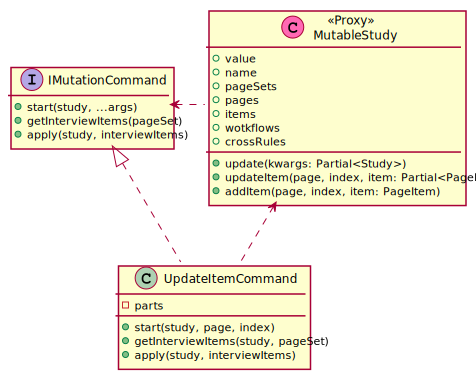

# Command plugins
We need to be able to initiate a study transformation and later to finalize it by applying new values. Each transformation will be implemented in a separate command plugin: an object that implements `IMutationCommand` interface.



The `start` method initiates the transformation by specifying where the transformation applies and modify the given `MutableStudy` to add special items that will hold values needed by the transformation. For example updating a `PageItem` will specify the page and the index in the page, then it will add `PageItem` objects to the page that will hold `variableName`, `type`, values.

The `getInterviewItem` method returns current values of items that contribute to the transformation.

The `apply` methods executes (or finalizes) the transformation using `update...` exposed by `MutableStudy`. It receives `InterviewItem` objects that hold the transformation content. For example to finalize a `PageItem` update: the variable name, type, etc. Finally the `updatePageItem` method will be called on `MutableStudy.

## Command parts construction
Command parts are study fragments (pages, page items, etc.) that will be added to the study to allow study modification. The parts are built as a standalone study to be merged with the target study. This is done in the `IMutationCommandAdapter` implementation contructor:

```ts
class UpdateItemCommand implements IMutationCommand {
  private readonly parts: Study;

  constructor() {
    this.parts = this.buildParts();
  }
  
  private buildParts() {
    const b = new StudyBuilder();
    libUpdateItem(b, "updateItem");
    libApply(b, "apply");
    b.page("mutation")
      .include("updateItem")
      .include("apply");
    return b.build();
  }
}
```
Where `libUpdateItem` adds a page with needed items (exactly as prebuilt libraries like sf12). `libApply` add a special page item whose variable name is `"__APPLY__"` of type `acknowledge`, it will be used as a marker to decide if the command can apply.

## Command initialization
A command needs to be initialized in order to add necessary parts at right place in the study and provide interview items with initial values. For example when updating a `PageItem` :
 - the `pages`, `pageSet`, `crossRules` return modified versions that includes the mutation parts built in the constructor.
 - the `getInterviewItems` method adds `InterviewItems` with proper values if the referenced page set contains the updated items.
 
```ts
class UpdateItemCommand implements IMutationCommand {
  private page?: Page;
  private item?: PageItem;
  
  //...

  start(value: MutableStudy, page: Page, index: number) {
    this.page = page;
    this.item = this.page.items[this.index];
    value.insertItems(page, index + 1, this.parts.items, this.parts.crossRules)
  }

  //...
  
  get getInterviewItems(pageSet: PageSet): IDomainCollection<InterviewItem> {
    if(!pageSet.hasItem(this.item)) return DomainCollection()
    return DomainCollection(
      new InterviewItem(this.parts.items[0], item.wording),
      // other items...
    );
  }
}
```

## Command execution
Eventually the `apply` method will restore the initial value (without mutation parts), build domain objects from received `InterviewItems` and call the `super.update...` methods. For example when updating a `PageItem`, we first build a `Partial<PageItem>` and then we call the `super.updatePageItem` method.
```ts
class UpdateItemCommand implements IMutationCommand {
  //...

  apply(value: MutableStudy, interviewItems: InterviewItems[]) {
    const kwargs = {
      wording: interviewItems.find(i => i.pageItem == this.parts.items[0])?.value,
      // other items...
    }
    value.updatePageItem(this.page, this.index, this.item.update(kwargs));
  }
}
```
