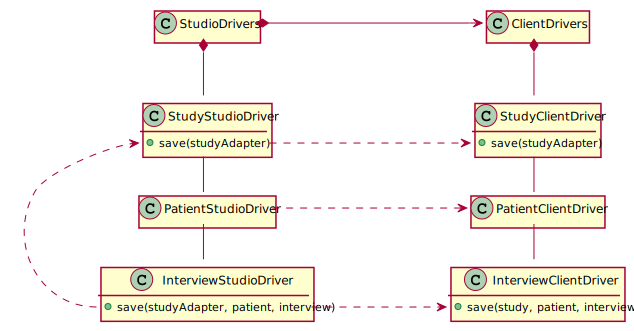

## Study and Patient adapters


`StudyAdapter` and `PatientAdapter` are proxies on respectively `Study` and `Patient` objects. They are modified under the ground when commands are applied. The `PatientAdapter` knows its corresponding `StudyAdapter` so it can call `getInterviewItem` to get values concerning the current command.


`StudyStudioDriver` and `PatientStudioDriver` implement respectively `IStudyDriver` and `IPatientDriver` but accept and return `StudyAdapter` and `PatientAdapter` objects. This conforms to the interfaces as proxies extends the object they contain. 
`InterviewStudioDriver` `save` method receives a `StudyAdapter` thus it can call the `apply` method that modify the study. Then it calls the `StudyStudioDriver` to save the `StudyAdapter`. Saving only occurs if the `InterviewItem` collection contains the apply marker item with value set to `true`.



## 2 phases mutation
**Setup** : encapsulate the client drivers in a `StudioDrivers` instance
```ts
const studioDrivers = new StudioDrivers(clientDrivers)
const currentStudy = await studioDrivers.studyDriver.getByName("P11-05");
const currentPatient = await studioDrivers.patientDriver.getByPatientCode(currentStudy, sites, "00001");
// ...
```
**Phase 1** : start a command (will mutate the current study to add specific studio items).
```ts
currentStudy.start(UpdateItemCommand, page, index);
const items = currentPatient.interviews[?].items // this contains additional specific studio items
// ... work with studio items
```
**Phase 2** : set the apply marker to true and save the items with studio drivers
```ts
const completedItems = items.update(i => i.pageItem.variableName = "__APPLY__" ? i.update({ value: true}) : i);
const completedInterview = patient.interview[x].update({ items: completedItems });
// this will call currentStudy.apply(...) and then studioDrivers.studyStudio.save(...)
await studioDrivers.interviewDriver.save(study, patient, completedInterview);
```
**Cancel**
```ts
currentStudy.start(NullCommand);
```